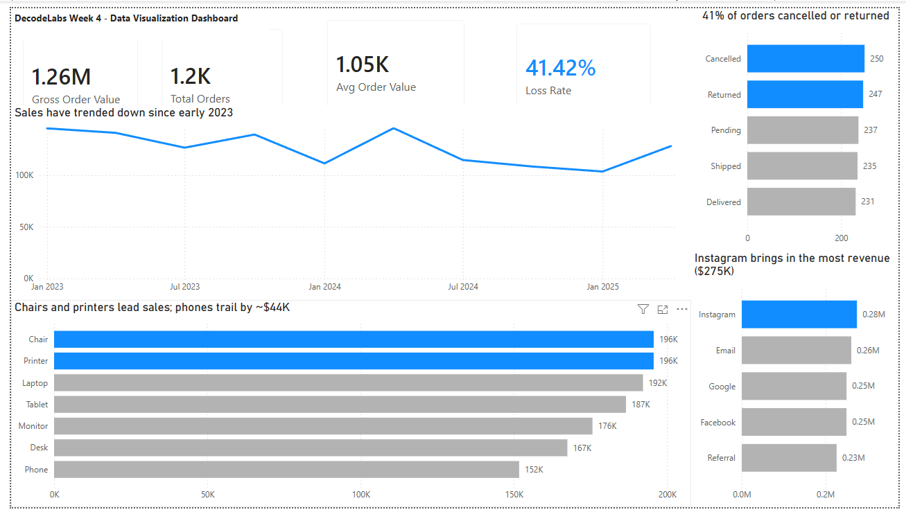

# E-Commerce Order Analysis: Data Visualization & Storytelling

**DecodeLabs Data Analytics Internship, Project 4** · Built in Power BI

## Business Question
An online retailer processed **$1.26M in orders** across 1,200 transactions (Jan 2023 – Jun 2025). Where is value being lost, and what should the business do about it?

## Key Findings
1. **41% of orders were cancelled or returned.** Only about 19% of order value is confirmed delivered.
2. **Sales have trended down since early 2023.** First-half order value fell about 19% from H1 2023 to H1 2025, driven by both fewer orders and a lower average order value.
3. **The loss rate is nearly identical across every product (39–44%).** It is also flat across payment methods and referral channels, which points to a process problem, not a product problem.
4. **Chairs and printers lead sales ($196K each); phones trail at $152K.** Instagram is the top referral source at $275K.

## Recommendation
Cut order losses before chasing new sales:
1. Add a required reason code to every cancellation and return so the root cause can be measured.
2. Audit the checkout and fulfillment process to find where orders are being lost.
3. Target reducing the loss rate from 41% to 30% within two quarters.

## Approach
- **Data preparation (Power Query):** converted Excel serial dates to real dates, replaced blank coupon codes with "None", and added Year and Month columns.
- **DAX measures:** Loss Rate, Gross Order Value, and Average Order Value.
- **Design principles:**
  - Action titles that state the conclusion.
  - Zero-baseline axes.
  - A single accent color to highlight the insight.
  - Direct labels instead of legends.
  - No pie charts.
- **Narrative structure:** Situation → Complication → Resolution.

### Analytical decisions
- **Trend chart by quarter, not by calendar month.** The original month-of-year chart summed all years together. Because the data ends in June 2025, January–June included three years of sales and July–December only two, which created a false "drop after June." Plotting by quarter removed the artifact.
- **Year-over-year comparison uses first halves only (H1 vs H1).** 2025 is a partial year, so full-year totals would not be comparable.

## Data Quality Note
`TotalPrice` equals `Quantity × UnitPrice` even for orders using discount codes (SAVE10, WINTER15). Coupon discounts are not reflected, so actual revenue is likely lower than reported.

## Files
| File | Description |
|---|---|
| `DecodeLabs_Project4_Eddy_Bartolome.pdf` | Final 2-page report (overview and recommendation) |
| `DecodeLabs_Project4_Eddy_Bartolome.pbix` | Power BI source file |
| `DatasetforDataAnalytics_2.xlsx` | Raw dataset |
| `overview.png` | Dashboard screenshot |

## Tools
Power BI (Power Query, DAX) · Microsoft Excel

---
**Eddy Bartolome** · B.S. Computer Information Systems · [LinkedIn](https://www.linkedin.com/in/YOUR-PROFILE)
